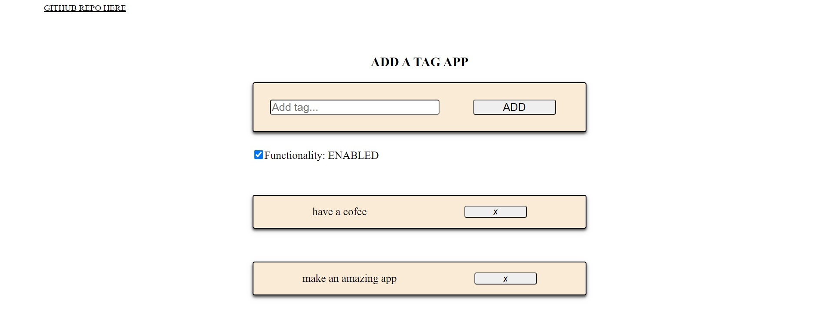

# add-a-tag-app

A SIMPLE "ADD-ITEMS-IN-THE-LIST" APP BUILT USING PURE JAVASCRIPT, HTML, CSS.
ALL FUNCTIONALITY CAN BE ENABLED OR DISABLED BY A USER WITH A SIMPLE CHECKBOX OPTION.
THE DATA IS STORED IN LOCALSTORAGE WHICH MEANS ALL SETTINGS ARE SAVED EVEN AFTER THE PAGE GETS REFRESHED.

LIVE DEMONSTRATION:
https://add-a-tag-app.netlify.app/

<p align="center">
  <h1 align="center">ADD-ITEMS-IN-THE-LIST</h1>

  <p align="center">
    <i>
    A simple app built using pure JavaScript, HTML, CSS. The app is fully responsive.
    All functionality can simply be enabled or disabled by a user upon checking / unchecking the functionality checkbox just below the input field.
    The data is stored locally in browser local storage which means all settings and saved tags stay there even after the page gets refreshed or reopened. 
    </i>
    <br />
    <br />
    
</p>
</br>

# Table of Contents

- [:floppy_disk: Installation](#floppy_disk-installation)
- [:microscope: About the code](#microscope-about-the-code)

</br>

# :floppy_disk: Installation

1. Clone the repo:
   ```sh
   git clone https://github.com/yuryiva/add-a-tag-app
   ```
2. Simply start the <i>index.html</i> file

# :microscope: About the code

Due to the fact that only pure JavaScript, HTML and CSS had been used the app doesn't get updated automatically after changes are applied to the code. That means one has to restart the browser manually every time changes are made.

<a href="https://find-a-country.netlify.app" target="_blank">Live presentation</a>
